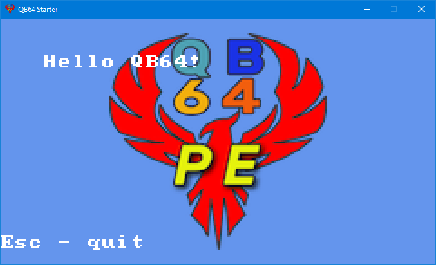

# qb64_starter

A starter code for QB64.



What's included in this project is as follows:
- Screen scaling
- EXE icon
- Image loading example
- KeyDown handler

To get started, simply open QB64 & load `main.bas` into the editor.

**Compressing** the EXE requires UPX, which you can obtain [here](https://github.com/upx/upx/).


## Setup

Make sure you have **QB64 Phoenix Edition** installed.

Change the path of QB64PE in `build.ps1`, then try running it with PowerShell:

```bat
powershell -file .\build.ps1
```

I'd recommend using this extension if you're using VSCode:

https://marketplace.visualstudio.com/items?itemName=GeorgeMcGinn.qb64-language

